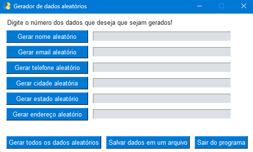

<div align="center">

</div>
<div align="center">

<p>    </p>

</div>


## -  Objective 🛠️
This project was created for submit fake data on unwanted websites. Sometimes we need to put data to acess some site features and if you don't want to receive the spam messages on email just use this app!





## - Technologies 🚀️
On this project i used **Faker** a python module that delivers fake data and **PySinmpleGUI** to make the interface look nicer to the client.

## - How to setup ⛳
First clone this project using:
```
git clone https://github.com/jravolio/Fake-data-generator
```
After that open you terminal on the project folder and run:
```
pip install -r requirements.txt
```
After that just execute the python file and everything shoud be functioning! :)
